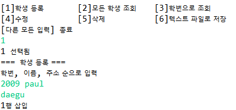

# 학생 관리 프로그램
## Student_Management_java


JAVA 와 Oracle DB연결하여 자바 콘솔 화면에서 작동하는 프로그램 입니다.
<kbd></kbd>

학생 등록, 조회, 수정, 삭제, 텍스트 파일 추출 기능이 있습니다.
<kbd></kbd>

odbc를 이용하였고, 모든 쿼리는 프로시저를 통하여 실행합니다.


``` sql
--모든 학생 조회
CREATE OR REPLACE PROCEDURE gt_selectall_java_student (p_cursor OUT) 
IS 
BEGIN
    OPEN p_cursor FOR 
        SELECT *
        FROM java_student;
END gt_selectall_java_student;
```


TO-DO
java의 nextInt()에서 문자열 입력시 강제 종료되는 버그 수정
- [x] 영어
- [ ] 한글